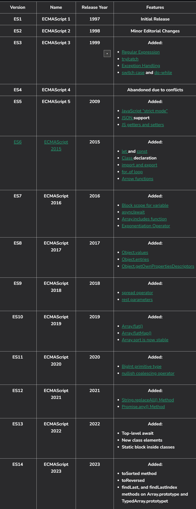

# 1.1 The History and Evolution of JavaScript
Origins and Early Development: JavaScript was built at Netscape by Brendan Eich and arrived on the scene in 1995. Initially, it was known as Mocha (Mocha refers to a type of high-quality coffee made from a specific coffee bean—perhaps Brendan Eich liked Mocha coffee!) and then LiveScript, before finally being renamed JavaScript to capitalize on the popularity of the Java programming language at the time.

The Birth of ECMAScript: JavaScript was submitted to ECMA International by its inventor. ECMA International is a non-profit organization that develops global standards for information and communication technology (ICT) and consumer electronics. This submission led to the formation of Technical Committee 39 (TC39), a group responsible for maintaining and updating the standard for JavaScript, known as ECMAScript.

ECMAScript is designed to manipulate and automate tasks within a host environment, such as web browsers and servers. It also supports key concepts of object-oriented programming (OOP), including objects, classes, inheritance, and encapsulation. Additionally, ECMAScript is a specification for a general-purpose programming language, and JavaScript, which is an implementation of ECMAScript, is capable of performing computations, manipulating data, and handling various programming tasks. The committee worked for years to standardize JavaScript, leading to the release of the first version of ECMAScript in June 1997. This played a crucial role in ensuring consistent JavaScript practices across web browsers.

## Key Versions and Features:
 
<h2 style="color:red ">Note:- No need to learn this version, just stay updated</h2>

### ECMAScript 1(1997) and 2 (1998):
Initial release and some minor changes introduced in this version

### ECMAScript 3 (1999):
 This version introduced various features like try/catch error handling and Regular Expressions. It also paved the way for AJAX, allowing web pages to load data in the background without needing a refresh. (Don’t worry if you don’t understand these terms now; we’ll cover them in detail later.) Libraries and Frameworks: Over time, libraries like jQuery (2006) made JavaScript easier to work with, while frameworks like AngularJS (2010) and React (2013) helped developers create even more complex applications with ease.

### ECMAScript 5 (2009) and ECMAScript 6 (2015):
 In ECMAScript 5, strict mode was introduced, which helps in writing safer code. ECMAScript 6, also known as ES6, brought powerful features like arrow functions and classes, making it easier to work with JavaScript compared to previous versions.

The Node.js Revolution: In 2009, Ryan Dahl introduced Node.js, which enabled JavaScript to be used for server-side programming. This meant developers could now build full applications using JavaScript, from the front end to the back end!

### ES6 (ECMAScript 2015) to ES2024 covers major updates to JavaScript
introducing new features and improvements aimed at making the language more powerful, efficient, and developer-friendly.

### ES6 (2015)
 brought essential features like let and const for block-scoped variables, arrow functions for concise syntax, template literals for string formatting, classes to simplify object-oriented programming, and modules to import/export code. It also introduced promises, which are useful for handling asynchronous operations, and destructuring, which allows easy extraction of data from objects and arrays.

### ES7 (2016)
 was a smaller update, adding two key features: the exponentiation operator (**), which simplifies math operations, and Array.prototype.includes(), making it easier to check if an array contains a specific element.

### ES8 (2017)
 expanded the language further with async/await, which made handling promises more readable and easier to manage. It also added object features like Object.entries() and Object.values() to work with object data more effectively.

### ES9 (2018)
 introduced rest and spread properties for objects, allowing you to extract and merge object properties easily. It also improved asynchronous code handling with asynchronous iteration, letting developers loop over async data streams.

### ES10 (2019)
 added features like Array.prototype.flat() and flatMap() to work with nested arrays and simplified the transformation of arrays. The Optional catch binding allowed catching errors without explicitly defining the error parameter, making the code cleaner.

### ES11 (2020)
 introduced features like BigInt to handle large integers beyond the Number type limit. The nullish coalescing operator (??) and optional chaining (?.) provided more concise ways to handle null or undefined values without throwing errors.

### ES12 (2021)
 brought improvements like logical assignment operators, which combine logical operations and assignments. It also introduced numeric separators (underscores in numbers) to improve readability, and Promise.any(), which resolves the first fulfilled promise in a list.

### ES13 (2022)
 included Top-level await, which allowed using await in the global context, making asynchronous code simpler in modules.

### ES14 (2023) 
expanded array methods with new ways to find indices and made it easier to work with arrays. It also added enhanced error handling, making debugging smoother.

ES2024 continues the trend of refining JavaScript, focusing on better performance and more user-friendly features. Some anticipated improvements are around enhancing functional programming tools, improving developer experience, and more efficient memory management, but exact features will become clear once finalized.

### Where It Is Now:
 The Present and Future: Today, JavaScript runs on clients across the globe, making it one of the most popular programming and scripting languages, with around 95% of websites using it. JavaScript continues to evolve, with new features being added every year, securing its top spot in web development trends. In other words, JavaScript has far outgrown its origins as a basic scripting language and is now an essential tool for creating dynamic, modern web applications—a promising sign for its future

 
 
 
 
 

# Next Point :- [1.2 How Important is JavaScript in Web Development?](./1.2_How_Important_is_JavaScript%20in_Web_Development.md)